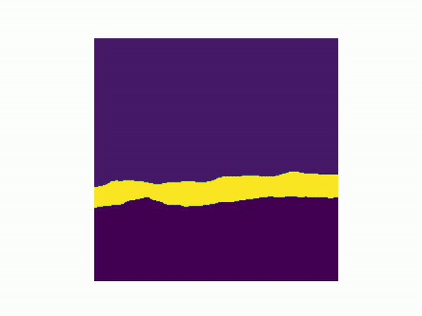

# Segmenetation on Videos

End Goal is to create an efficient model that can provide object segementation in videos without frame rate depreciation.

## Current Model

The current model uses a TensorFlow Hub model made for image segmentation, and applies it on fragmentations of the desired video. Via the results obtained, an analysis is done.
### Test Case 1 : Indoors
  
### Test Case 2 : Outdoors
  

